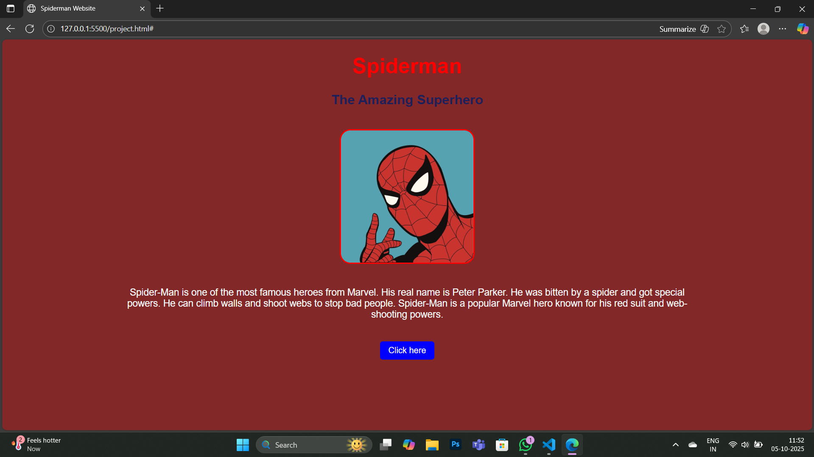

# Spider-Man Website

This is a simple beginner-friendly Spider-Man website using HTML and CSS.  

## Features
- Headings and subheadings
- Different fonts, colors, and text sizes
- Image of Spider-Man
- Clickable link to Wikipedia for more information
- Paragraph centered with margin for better readability

## Screenshot

## Implementation Guide

1. Clone the repository or download the files.  
2. Open `index.html` in your web browser.  
3. Enjoy the webpage!

